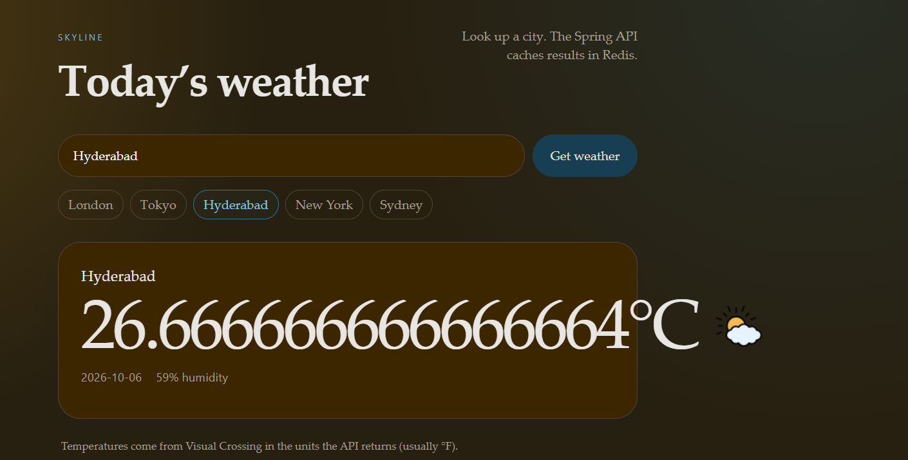

# Weather Spring

[Roadmap](https://roadmap.sh/projects/weather-api-wrapper-service)



A small weather app: a Spring Boot API that looks up a place on [Visual Crossing](https://www.visualcrossing.com/) and caches the result in Redis, plus a React UI to search cities.

## Layout

- `backend/` — Spring Boot 4, Java 21, Redis cache
- `react/` — Vite + React frontend
- `docker-compose.yml` — Redis, API, and UI as one stack

## API

`GET /{place}` returns today’s conditions for a city or country.

Example: `GET http://localhost:8080/London`

```json
{
  "datetime": "2026-10-06",
  "humidity": 72.0,
  "city": "London, England, United Kingdom",
  "temp": 58.1,
  "icon": "partly-cloudy-day"
}
```

Set `VISUAL_CROSSING_API` to your Visual Crossing key. Redis is expected on `localhost:6379` unless you override `SPRING_DATA_REDIS_HOST`.

## Run with Docker

Copy `.env.example` to `.env` and put your API key in it, then:

```bash
docker compose up --build
```

`docker-compose.yml` and `compose.yaml` describe the same stack so Docker Desktop can open the project directly.

Open [http://localhost:3000](http://localhost:3000). The UI proxies `/api/...` to the backend. The API is also on [http://localhost:8080](http://localhost:8080).

## Run locally

1. Start Redis on port 6379.
2. From `backend/`, set `VISUAL_CROSSING_API` and run `./mvnw spring-boot:run` (Windows: `mvnw.cmd spring-boot:run`).
3. From `react/`, run `npm install` then `npm run dev`.
4. Open [http://localhost:5173](http://localhost:5173). Vite proxies `/api` to `http://localhost:8080`.
